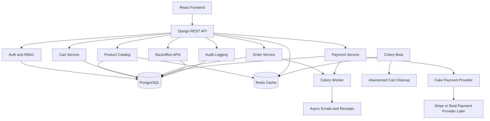
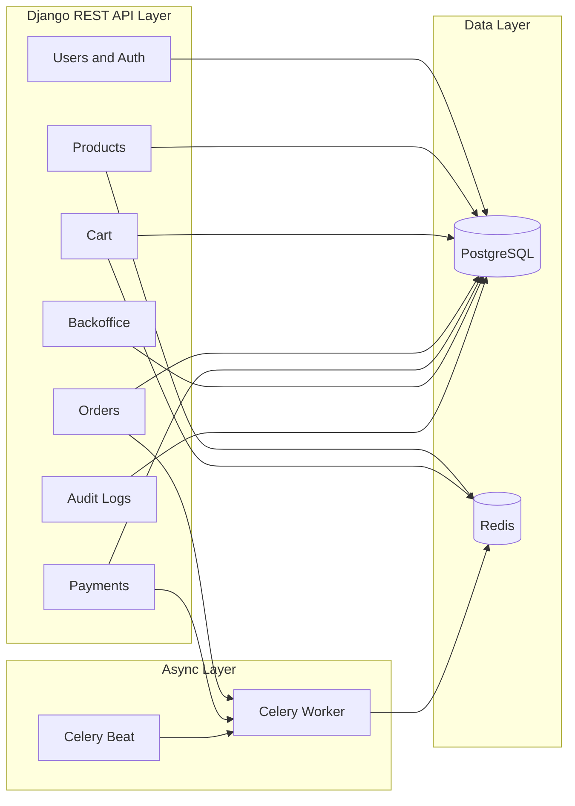
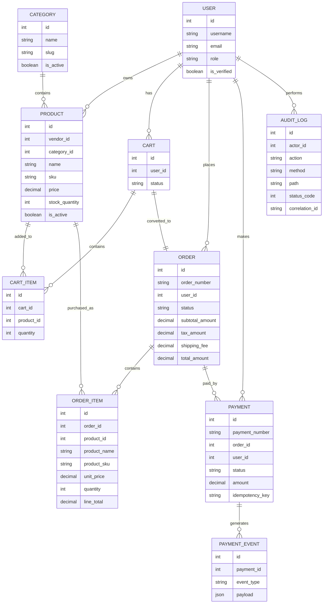
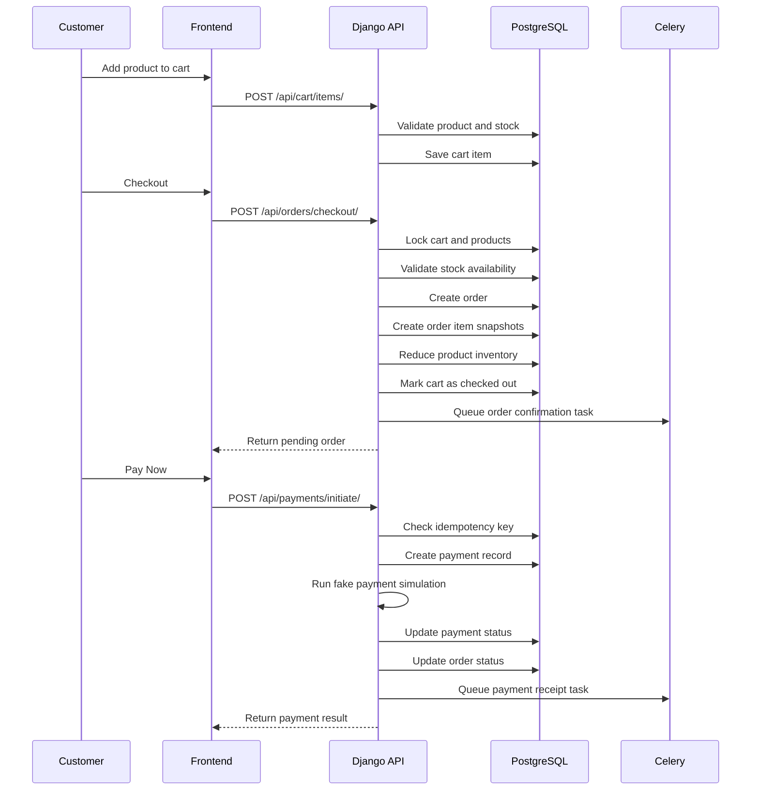
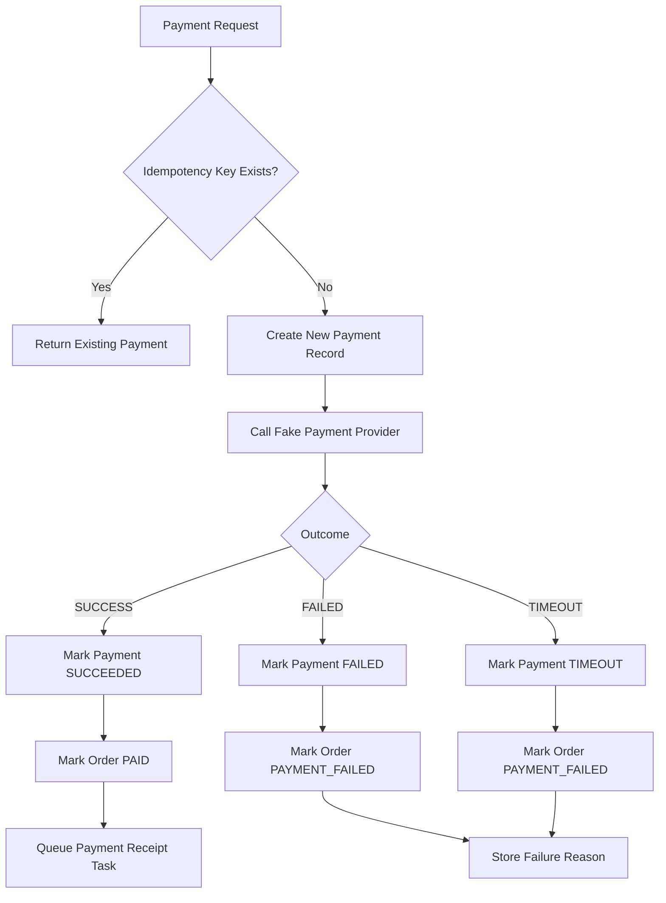
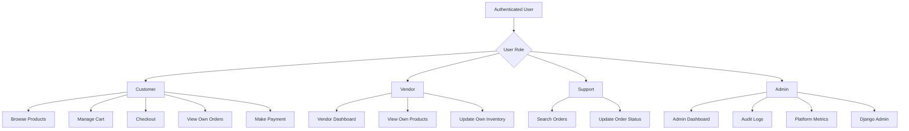
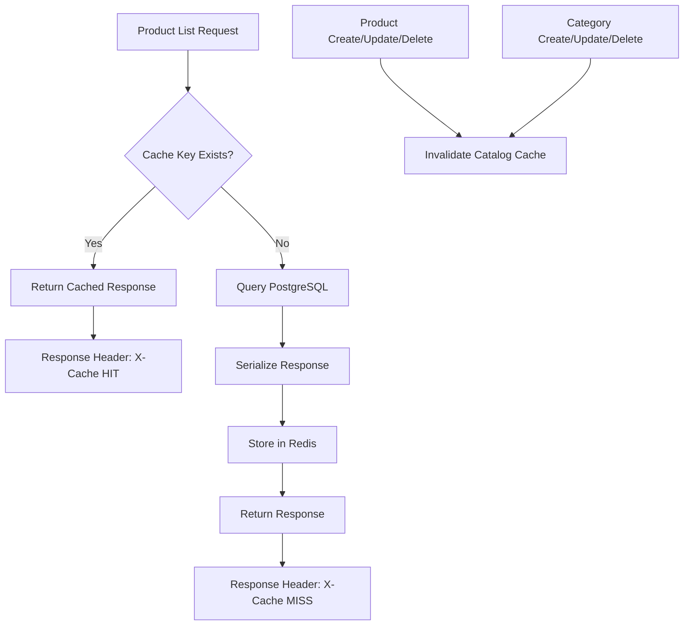
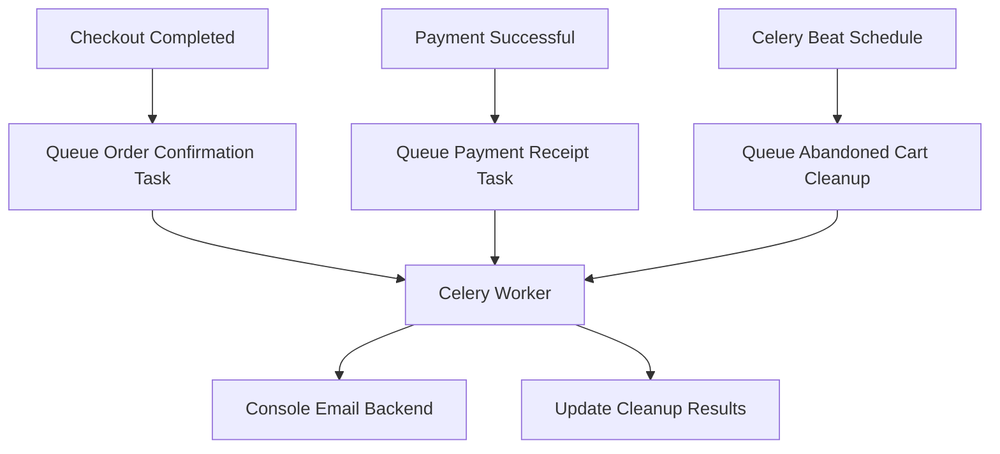
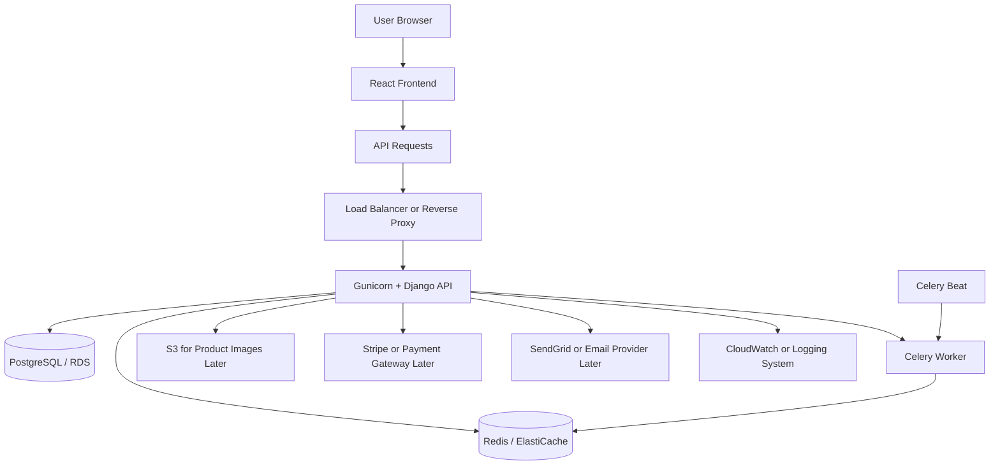

# E-Commerce Backend Platform

A production-style full-stack e-commerce platform built with **Django, PostgreSQL, Redis, Celery, Docker, and React**.

This project was designed as a real-world backend system, not just a simple CRUD app. It supports customer shopping flows, vendor inventory management, support order operations, admin analytics, Redis caching, fake payment processing, audit logs, background jobs, automated tests, and Dockerized local/production workflows.

The goal of this project is to simulate how a scalable e-commerce backend is designed and built in production, using fake seed data first and keeping the system ready for future real-world integrations such as Stripe, AWS, shipping APIs, product feeds, and real customer/order data.

---

## Project Summary

This platform supports four major roles:

| Role     | What They Can Do                                                          |
| -------- | ------------------------------------------------------------------------- |
| Customer | Browse products, manage cart, checkout, view orders, simulate payments    |
| Vendor   | View vendor dashboard, track sales, manage inventory                      |
| Support  | Search customer orders and update order status                            |
| Admin    | View platform metrics, payment summaries, audit logs, and system activity |

The backend was built phase by phase:

1. Dockerized Django, PostgreSQL, and Redis setup
2. JWT authentication and role-based access control
3. Product catalog and category APIs
4. Cart management APIs
5. Transactional checkout and order management
6. Fake payment gateway with idempotency
7. Redis caching for catalog APIs
8. PostgreSQL query optimization and fake large-scale data seeding
9. Celery background jobs
10. Admin, vendor, and support business APIs
11. Security hardening and audit logging
12. Pytest test suite
13. Production Docker improvements with Gunicorn
14. React frontend for customer shopping flow
15. Admin, vendor, support, and audit dashboards
16. Final README, architecture diagrams, and project polish

---

## Tech Stack

### Backend

| Area            | Technology                                |
| --------------- | ----------------------------------------- |
| Language        | Python                                    |
| Framework       | Django, Django REST Framework             |
| Database        | PostgreSQL                                |
| Cache           | Redis                                     |
| Background Jobs | Celery, Celery Beat                       |
| Auth            | JWT with SimpleJWT                        |
| Testing         | Pytest, pytest-django, pytest-cov         |
| Runtime         | Docker, Docker Compose, Gunicorn          |
| Security        | RBAC, throttling, audit logs, request IDs |

### Frontend

| Area       | Technology    |
| ---------- | ------------- |
| Framework  | React         |
| Language   | TypeScript    |
| Build Tool | Vite          |
| Routing    | React Router  |
| API Client | Axios         |
| Animation  | Framer Motion |
| Charts     | Recharts      |
| Icons      | Lucide React  |

---

## Why This Project Is More Than a Basic GitHub Project

Many e-commerce projects only implement simple product CRUD and cart APIs. This project goes beyond that by including production-style backend patterns:

* Transactional checkout with inventory consistency
* Product price snapshots inside orders
* Idempotency keys for payments
* Fake payment provider abstraction
* Redis caching with invalidation
* Celery background jobs
* PostgreSQL indexing and benchmark commands
* Role-based access control
* Admin, vendor, and support APIs
* Audit logging for write operations
* Request correlation IDs
* Dockerized local and production-like environments
* Automated test suite
* React frontend connected to real backend APIs

This makes the project closer to how real e-commerce systems are built in companies.

---

## Core Features

### Customer Features

* Register and login
* Browse products
* Search and filter products
* Add products to cart
* Update cart item quantity
* Remove items from cart
* Checkout from cart
* View orders
* Simulate fake payment success/failure

### Vendor Features

* View vendor dashboard
* Track sales summary
* View own products
* Update product stock
* Activate or deactivate products

### Support Features

* Search customer orders
* Filter orders by status
* View order details
* Update order lifecycle status

### Admin Features

* View platform-wide metrics
* Track users, products, orders, payments, and revenue
* View audit logs
* Monitor write operations
* Access Django admin panel

### Backend Engineering Features

* JWT authentication
* Custom user model
* Role-based access control
* PostgreSQL relational schema
* Redis catalog caching
* Celery async task processing
* Payment idempotency
* Transaction-safe checkout
* Audit logging
* Request correlation IDs
* API throttling
* Health check endpoint
* Pytest test coverage
* Docker Compose setup
* Gunicorn production-like setup

---

# Architecture Diagrams

## 1. High-Level System Architecture



---

## 2. Backend Service Architecture



---

## 3. Database Entity Relationship Diagram



---

## 4. Customer Checkout Flow



---

## 5. Payment and Idempotency Flow



---

## 6. Role-Based Access Control Flow



---

## 7. Redis Caching Flow



---

## 8. Celery Background Job Flow



---

## 9. Deployment Architecture



---

## How We Built It

### 1. Started with Dockerized Backend Infrastructure

We first created a Dockerized Django backend with PostgreSQL and Redis. This gave the project a real development environment instead of using SQLite or local-only dependencies.

Why this matters:

* PostgreSQL behaves closer to real production databases
* Redis can be used for real caching and Celery broker support
* Docker keeps the setup consistent across machines
* The project can be extended toward AWS deployment later

---

### 2. Built Authentication and RBAC

We added a custom Django user model with roles:

* Customer
* Vendor
* Support
* Admin

Then we added JWT login using SimpleJWT.

Why this matters:

* Real e-commerce platforms have multiple user types
* APIs must behave differently depending on user permissions
* Vendors should not access other vendors' products
* Customers should not access admin or support APIs
* Admin-only audit logs protect sensitive operational data

---

### 3. Built Product Catalog APIs

We added categories and products with:

* Vendor ownership
* SKU
* Price
* Stock quantity
* Product metadata
* Active/inactive status
* Search and filtering
* Pagination-ready responses

Why this matters:

* Product catalog is the foundation of any e-commerce platform
* Vendor-owned products make the platform multi-sided
* SKU and stock fields prepare the system for real inventory workflows

---

### 4. Built Cart System

We added cart and cart item models.

Customers can:

* View cart
* Add products
* Update quantity
* Remove items
* Clear cart

The cart validates product stock before adding items.

Why this matters:

* Cart is separate from order
* Inventory is not reduced until checkout
* Customers can safely modify their cart before placing an order

---

### 5. Built Transactional Checkout

Checkout converts an active cart into an order.

During checkout, the backend:

* Locks the cart
* Locks products
* Validates stock
* Creates the order
* Creates order item snapshots
* Reduces product inventory
* Marks cart as checked out

Why this matters:

* Prevents overselling
* Keeps order data consistent
* Stores price snapshots so future product price changes do not affect old orders
* Uses database transactions like a real production backend

---

### 6. Built Fake Payment Gateway

Instead of integrating Stripe immediately, we built a fake payment provider first.

The fake provider supports:

* Success
* Failure
* Timeout

We also added:

* Payment records
* Payment events
* Idempotency keys
* Provider references
* Fake webhook endpoint
* Order status updates

Why this matters:

* Payment workflows are complex
* Fake payment lets us test all edge cases without real money
* Idempotency prevents duplicate payments
* Later we can replace fake provider with Stripe without redesigning the whole system

---

### 7. Added Redis Caching

We cached catalog list and detail APIs using Redis.

The API returns:

* `X-Cache: MISS` for first request
* `X-Cache: HIT` for repeated request

Cache is invalidated when products or categories change.

Why this matters:

* Product catalog is read-heavy
* Redis reduces repeated PostgreSQL queries
* This simulates real e-commerce performance optimization

---

### 8. Added PostgreSQL Indexing and Benchmarks

We added indexes for common query patterns:

* Active products
* Category filtering
* Price filtering
* Stock filtering
* Vendor-owned products
* Created date ordering

We also added benchmark commands to compare naive queries with optimized queries.

Why this matters:

* Real systems must handle large product datasets
* Query optimization matters when product count grows
* `select_related` and indexes reduce database load

---

### 9. Added Celery Background Jobs

We added Celery and Celery Beat using Redis as broker.

Background tasks include:

* Order confirmation task
* Payment receipt task
* Abandoned cart cleanup task

Why this matters:

* Slow work should not block API responses
* Emails and cleanup jobs belong in async workers
* This is a common production backend pattern

---

### 10. Added Backoffice APIs

We added APIs for:

* Admin dashboard
* Vendor dashboard
* Vendor inventory update
* Support order search
* Support order status update

Why this matters:

* E-commerce is not only a customer shopping experience
* Internal operations are a huge part of real platforms
* Vendors and support teams need business-specific workflows

---

### 11. Added Security and Audit Logging

We added:

* Request IDs
* Audit logs
* API throttling
* Secure response headers
* Admin-only audit log API
* IP and user-agent tracking

Why this matters:

* Production systems need traceability
* Write operations should be auditable
* Request IDs help debug issues across logs and services
* Throttling protects APIs from abuse

---

### 12. Added Tests

We added pytest tests for:

* Auth
* RBAC
* Products
* Cart
* Checkout
* Payments
* Backoffice APIs
* Audit logs

Why this matters:

* Real projects must be testable
* Tests prevent breaking existing features
* This makes future development safer

---

### 13. Added React Frontend

We built a dynamic frontend with:

* Landing page
* Login/register
* Product catalog
* Search and filters
* Cart
* Checkout
* Orders
* Fake payment button
* Vendor dashboard
* Support dashboard
* Admin dashboard
* Audit logs page

Why this matters:

* The project is now end-to-end
* The frontend consumes real backend APIs
* It demonstrates full-stack development, not only backend APIs

---

## What Happens If We Use Real Data?

Right now the project uses fake seed data and fake payment simulation. This was intentional because it lets us build and test the complete platform safely.

With real data, this project can be extended in the following ways:

### 1. Real Product Data

Fake products can be replaced with real product feeds from:

* Vendor uploads
* CSV imports
* Supplier APIs
* Admin dashboard product entry
* Marketplace integrations

What changes:

* Product ingestion pipelines would be added
* Product validation would become stricter
* Images would move to S3 or Cloudinary
* Search could move from simple PostgreSQL filtering to OpenSearch

---

### 2. Real Customer Data

Fake customers can be replaced with real registered users.

What changes:

* Email verification would be required
* Password reset flow would be added
* Address book models would be added
* User privacy controls would be needed
* Production authentication security would be tightened

---

### 3. Real Payments

The fake payment provider can be replaced with Stripe, PayPal, Razorpay, or another provider.

What changes:

* Fake provider becomes Stripe provider
* Webhook signature verification becomes mandatory
* Refund workflow would be added
* Payment disputes and chargebacks would be handled
* PCI-sensitive data would never touch our server directly

The current design already supports this because the payment logic is separated into a provider-style service.

---

### 4. Real Shipping

Shipping can be integrated with:

* Shippo
* EasyPost
* UPS/FedEx APIs
* Internal warehouse APIs

What changes:

* Shipment model would be added
* Tracking numbers would be stored
* Delivery status would update from webhooks
* Support dashboard would show shipment history

---

### 5. Real Tax Calculation

The current project uses simple tax calculation. In production, it can be replaced with:

* TaxJar
* Avalara
* Stripe Tax
* Region-specific tax APIs

What changes:

* Tax would depend on customer address
* Product category may affect tax rate
* Tax calculation would happen during checkout

---

### 6. Real Deployment

The current Docker setup can be deployed to AWS.

Possible AWS architecture:

| Component          | AWS Service               |
| ------------------ | ------------------------- |
| Django API         | ECS or EC2                |
| PostgreSQL         | RDS PostgreSQL            |
| Redis              | ElastiCache               |
| Static/media files | S3                        |
| Logs               | CloudWatch                |
| Load balancing     | Application Load Balancer |
| Secrets            | AWS Secrets Manager       |
| Background jobs    | ECS worker service        |
| CI/CD              | GitHub Actions            |

---

## Advantages of This Architecture

### 1. Scalable Backend Design

The backend is modular. Each domain has its own Django app:

* users
* products
* cart
* orders
* payments
* backoffice
* audit

This makes the project easier to maintain and extend.

---

### 2. Better Data Consistency

Checkout uses database transactions and row locking.

This prevents issues like:

* Order created but inventory not reduced
* Inventory reduced but order failed
* Two customers buying the last item at the same time
* Duplicate checkout creating inconsistent data

---

### 3. Payment Safety

The payment system uses idempotency keys.

This prevents duplicate payment creation if:

* User clicks Pay twice
* Network retries happen
* Frontend resends the request
* Provider webhook is delivered multiple times

---

### 4. Faster Catalog Reads

Redis caching reduces repeated product listing queries.

This is important because product pages are read-heavy in e-commerce systems.

---

### 5. Production-Like Async Processing

Celery moves slow tasks out of the request-response cycle.

This improves API responsiveness and keeps the backend scalable.

---

### 6. Real Business Workflows

The project includes internal workflows, not just customer shopping.

This is closer to real e-commerce companies where vendors, support teams, and admins all need different dashboards.

---

### 7. Observability and Debugging

Audit logs and request IDs make the system easier to debug.

If something goes wrong, an admin can trace:

* Who made the request
* What endpoint was called
* What action was performed
* What status code was returned
* Which request ID was involved

---

### 8. Testable and Maintainable

The test suite validates the major flows.

This makes the system safer to modify and extend.

---

## How This Is Different From Existing E-Commerce Options

There are many existing e-commerce options today, such as hosted store builders, plugin-based platforms, marketplace tools, and headless commerce platforms.

This project is different because it focuses on **backend ownership and engineering depth**.

### Compared to Hosted Store Builders

Hosted platforms are easy to start with, but they usually limit backend customization.

This project gives full control over:

* Database schema
* Checkout logic
* Payment workflow
* Vendor rules
* Inventory rules
* Audit logs
* Internal APIs
* Deployment architecture

### Compared to Plugin-Based Platforms

Plugin-based platforms can become hard to maintain when too many plugins are added.

This project keeps business logic inside the backend codebase, making it easier to reason about:

* Order status transitions
* Payment idempotency
* Role permissions
* Vendor inventory updates
* Audit logging

### Compared to Simple GitHub E-Commerce Projects

Most portfolio projects only include:

* Product CRUD
* Cart
* Basic checkout

This project includes:

* RBAC
* PostgreSQL optimization
* Redis caching
* Celery workers
* Fake payments with idempotency
* Backoffice dashboards
* Audit logs
* Request IDs
* Tests
* Docker production workflow
* React frontend

### Compared to Enterprise Headless Commerce Systems

Enterprise headless commerce tools are powerful but often complex, expensive, and abstracted away.

This project shows how the core system works internally:

* How checkout is designed
* How inventory is protected
* How payments are modeled
* How cache invalidation works
* How internal teams manage operations
* How audit logs are captured

This makes it valuable for learning, interviews, and demonstrating backend system design skills.

---

## Project Structure

```text
ecommerce-backend-platform/
├── audit/                  # Audit logging and admin-only audit APIs
├── backoffice/             # Admin, vendor, and support business APIs
├── cart/                   # Cart and cart item APIs
├── config/                 # Django settings, URLs, Celery config
├── core/                   # Health check and request middleware
├── orders/                 # Checkout and order management
├── payments/               # Fake payment gateway and payment events
├── products/               # Catalog APIs, caching, seed data, benchmarks
├── users/                  # Custom user model, JWT auth, RBAC
├── tests/                  # Pytest test suite
├── frontend/               # React + TypeScript frontend
├── docs/screenshots/       # Screenshot placeholders
├── docker-compose.yml
├── docker-compose.prod.yml
├── Dockerfile
├── Makefile
├── requirements.txt
└── README.md
```

---

## Local Setup

### 1. Clone the Repository

```bash
git clone https://github.com/YOUR_USERNAME/ecommerce-backend-platform.git
cd ecommerce-backend-platform
```

### 2. Create Environment File

```bash
cp .env.example .env
```

### 3. Start Docker Services

```bash
docker compose up --build -d
```

### 4. Run Migrations

```bash
docker compose exec web python manage.py migrate
```

### 5. Seed Fake Catalog Data

```bash
docker compose exec web python manage.py seed_catalog --vendors 25 --customers 500 --categories 30 --products 5000
```

### 6. Create Test Users

```bash
docker compose exec web python manage.py shell -c "
from django.contrib.auth import get_user_model
User = get_user_model()

users = [
    ('customer1', 'customer1@example.com', 'CUSTOMER', False, False),
    ('vendor1', 'vendor1@example.com', 'VENDOR', False, False),
    ('support1', 'support1@example.com', 'SUPPORT', False, False),
    ('admin1', 'admin1@example.com', 'ADMIN', True, True),
]

for username, email, role, is_staff, is_superuser in users:
    user, _ = User.objects.get_or_create(username=username, defaults={'email': email, 'role': role})
    user.email = email
    user.role = role
    user.is_staff = is_staff
    user.is_superuser = is_superuser
    user.set_password('Password123!')
    user.save()

print('Users ready')
"
```

---

## Running the Application

Frontend:

```text
http://127.0.0.1:5173
```

Backend:

```text
http://127.0.0.1:8000
```

Django Admin:

```text
http://127.0.0.1:8000/admin/
```

Health Check:

```bash
curl http://127.0.0.1:8000/api/health/
```

Expected response:

```json
{
  "status": "ok",
  "database": "connected",
  "redis": "connected",
  "service": "ecommerce-backend-platform"
}
```

---

## Test Login Accounts

| Role     | Username  | Password     |
| -------- | --------- | ------------ |
| Customer | customer1 | Password123! |
| Vendor   | vendor1   | Password123! |
| Support  | support1  | Password123! |
| Admin    | admin1    | Password123! |

---

## API Overview

### Auth

| Method | Endpoint                   |
| ------ | -------------------------- |
| POST   | `/api/auth/register/`      |
| POST   | `/api/auth/login/`         |
| POST   | `/api/auth/token/refresh/` |
| GET    | `/api/auth/me/`            |

### Products

| Method | Endpoint                      |
| ------ | ----------------------------- |
| GET    | `/api/catalog/products/`      |
| POST   | `/api/catalog/products/`      |
| GET    | `/api/catalog/products/{id}/` |
| PATCH  | `/api/catalog/products/{id}/` |
| DELETE | `/api/catalog/products/{id}/` |
| GET    | `/api/catalog/categories/`    |

### Cart

| Method | Endpoint                       |
| ------ | ------------------------------ |
| GET    | `/api/cart/`                   |
| POST   | `/api/cart/items/`             |
| PATCH  | `/api/cart/items/{id}/`        |
| DELETE | `/api/cart/items/{id}/remove/` |
| DELETE | `/api/cart/clear/`             |

### Orders

| Method | Endpoint                   |
| ------ | -------------------------- |
| POST   | `/api/orders/checkout/`    |
| GET    | `/api/orders/`             |
| GET    | `/api/orders/{id}/`        |
| POST   | `/api/orders/{id}/cancel/` |

### Payments

| Method | Endpoint                       |
| ------ | ------------------------------ |
| POST   | `/api/payments/initiate/`      |
| GET    | `/api/payments/`               |
| GET    | `/api/payments/{id}/`          |
| POST   | `/api/payments/webhooks/fake/` |

### Backoffice

| Method | Endpoint                                          |
| ------ | ------------------------------------------------- |
| GET    | `/api/backoffice/admin/summary/`                  |
| GET    | `/api/backoffice/vendor/summary/`                 |
| GET    | `/api/backoffice/vendor/products/`                |
| PATCH  | `/api/backoffice/vendor/products/{id}/inventory/` |
| GET    | `/api/backoffice/support/orders/`                 |
| PATCH  | `/api/backoffice/support/orders/{id}/status/`     |

### Audit

| Method | Endpoint           |
| ------ | ------------------ |
| GET    | `/api/audit/logs/` |

---

## Frontend Pages

| Page              | Path        | Access   |
| ----------------- | ----------- | -------- |
| Landing Page      | `/`         | Public   |
| Products          | `/products` | Public   |
| Login             | `/login`    | Public   |
| Register          | `/register` | Public   |
| Cart              | `/cart`     | Customer |
| Checkout          | `/checkout` | Customer |
| Orders            | `/orders`   | Customer |
| Vendor Dashboard  | `/vendor`   | Vendor   |
| Support Dashboard | `/support`  | Support  |
| Admin Dashboard   | `/admin`    | Admin    |
| Audit Logs        | `/audit`    | Admin    |

---

## Testing

Run all tests:

```bash
docker compose exec web pytest
```

Run tests with coverage:

```bash
docker compose exec web pytest --cov=. --cov-report=term-missing
```

The test suite covers:

* Authentication
* JWT login
* RBAC permissions
* Product APIs
* Cart APIs
* Checkout workflow
* Inventory reduction
* Order cancellation
* Payment success/failure
* Idempotency behavior
* Backoffice permissions
* Audit logging

---

## Performance and Benchmarking

Seed fake data:

```bash
docker compose exec web python manage.py seed_catalog --vendors 25 --customers 500 --categories 30 --products 5000
```

Run catalog benchmark:

```bash
docker compose exec web python manage.py benchmark_catalog --limit 100 --explain
```

Check Redis cache keys:

```bash
docker compose exec redis redis-cli -n 1 KEYS "*catalog*"
```

The benchmark demonstrates:

* Naive query behavior
* Optimized query behavior
* Reduced N+1 queries using `select_related`
* PostgreSQL execution plans
* Redis cache access

---

## Docker Commands

Start services:

```bash
docker compose up -d
```

Rebuild services:

```bash
docker compose up --build -d
```

Stop services:

```bash
docker compose down --remove-orphans
```

View logs:

```bash
docker compose logs web --tail=120
```

Run production-like Gunicorn setup:

```bash
docker compose -f docker-compose.prod.yml up --build -d
```

---

## Makefile Commands

| Command          | Description                          |
| ---------------- | ------------------------------------ |
| `make up`        | Start local Docker services          |
| `make down`      | Stop services                        |
| `make build`     | Rebuild services                     |
| `make logs`      | View backend logs                    |
| `make migrate`   | Run migrations                       |
| `make test`      | Run tests                            |
| `make coverage`  | Run coverage                         |
| `make seed`      | Seed fake catalog data               |
| `make benchmark` | Run benchmark                        |
| `make cachekeys` | View Redis catalog cache keys        |
| `make prod-up`   | Start production-like Gunicorn setup |
| `make prod-down` | Stop production setup                |

